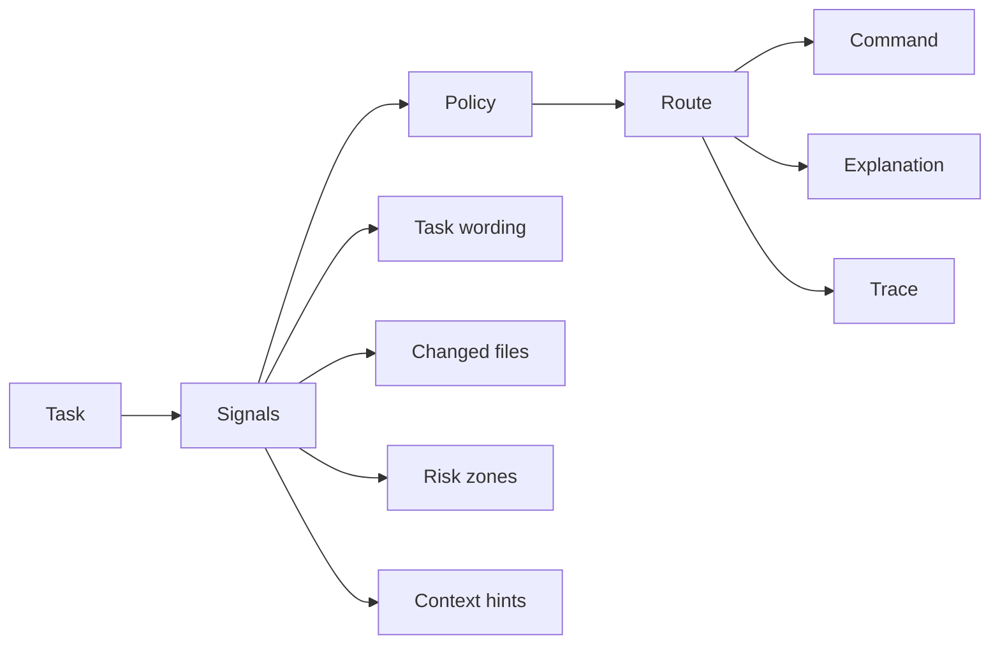

<p align="center">
  
</p>

<h1 align="center">Routis</h1>

<p align="center">
  <strong>Adaptive execution intelligence for AI coding workflows.</strong>
</p>

<p align="center">
  <a href="https://github.com/alenisaw/routis/stargazers"></a>
  <a href="https://github.com/alenisaw/routis/commits/main"></a>
  <a href="LICENSE"></a>
</p>

<p align="center">
  <a href="#why-it-exists">Why it exists</a> ·
  <a href="#capabilities">Capabilities</a> ·
  <a href="#how-it-works">How it works</a> ·
  <a href="#installation">Installation</a> ·
  <a href="#usage">Usage</a> ·
  <a href="#development">Development</a>
</p>

---

Routis is an **execution-intelligence layer** for AI coding workflows.

It adds a routing layer before execution. Given a task, Routis evaluates the request, reads useful project signals, applies local policy, selects an execution route, prepares a command preview, and records the decision for later inspection.

The point is simple: AI-assisted development should not use the same execution path for every task. Small edits should stay lightweight. Risky changes should receive stronger handling. Project context should be selected deliberately. Every routing decision should be understandable after the fact.

## Why it exists

AI coding tools usually receive a prompt and start working immediately. That is convenient, but it makes execution inconsistent. The model, reasoning level, context scope, and command shape are often chosen manually or left to defaults.

Routis makes that decision explicit. It turns task handling into a routing step that can be inspected, repeated, tuned, and stored locally.

| Problem | Routis response |
|---|---|
| Same settings for different tasks | Route each task into an execution profile |
| Too much context for small edits | Keep lightweight tasks cheap and focused |
| Shallow handling of risky changes | Elevate tasks touching sensitive areas |
| Unclear command decisions | Produce an explainable route |
| Hard-to-review sessions | Store local traces and session records |
| Project-specific habits | Apply local policy files |

## Capabilities

Routis combines routing, context control, policy, explainability, and local records into one workflow layer.

| Capability | What it does |
|---|---|
| Adaptive routing | Selects a fitting execution profile for the task |
| Context control | Uses repository signals without blindly loading everything |
| Risk detection | Recognizes sensitive zones such as config, auth, schema, workflow, and package files |
| Policy control | Applies local routing rules and project-specific overrides |
| Dry run | Shows the route and command preview before execution |
| Explain mode | Shows which signals influenced the selected route |
| Sessions | Keeps continuity across related tasks |
| Traces | Records routing decisions as reviewable local artifacts |
| Token economy | Reduces unnecessary context, reasoning depth, and repeated work |

Profiles stay intentionally simple.

| Profile | Typical use |
|---|---|
| `cheap` | Typos, formatting, comments, small documentation edits |
| `balanced` | Ordinary implementation, tests, focused refactors |
| `deep` | Debugging, migrations, edge cases, config/auth/schema work |
| `extradeep` | Redesigns, rewrites, architecture-level changes |
| `default` | Automatic selection from task and project signals |

## How it works

Routis handles a task as a routing pipeline.



The pipeline starts with the task text and lightweight project signals. Routis checks task wording, requested intent, file references, changed files, and known risk zones. Those signals are combined with local policy rules. The result is an execution route: selected profile, execution mode, command preview, explanation text, and trace metadata.

A route is designed to be readable.

```text
Requested profile:  default
Effective profile:  deep
Signals matched:    debug, config
Risk zones:         config
Mode:               dry-run
Reason:             task asks for debugging and touches a risk zone
Command preview:    codex exec --reasoning high -- "debug config loader"
```

The trace makes the decision auditable without turning the repository into a prompt dump. It stores the routing outcome and the signals that shaped it, while sensitive task content can be represented as a hash.

## Installation

For now, build Routis from source.

```bash
git clone https://github.com/alenisaw/routis.git
cd routis
cargo build --release
```

Run the compiled binary.

```bash
./target/release/routis --help
```

Install it locally from the repository.

```bash
cargo install --path .
```

After local installation, the `routis` command becomes available from the shell.

```bash
routis --help
```

## Usage

Route a task automatically.

```bash
routis "fix typo in README"
```

Preview the route without execution.

```bash
routis --dry-run "refactor routing module"
```

Show routing details.

```bash
routis --explain "investigate auth regression"
```

Force a profile when the route is known in advance.

```bash
routis --profile deep "debug failing config loader"
```

Use a policy file.

```bash
routis --policy-file ./configs/policies/default.yaml "update config loader"
```

Open the interactive interface.

```bash
routis tui
```

### CLI shape

```bash
routis [OPTIONS] [TASK]

Options:
  --task <TEXT>           Task to route
  --profile <PROFILE>     cheap | balanced | deep | extradeep | default
  --policy-file <PATH>    Load routing policy from a file
  --dry-run               Print the route without executing
  --execute               Execute the generated command
  --explain               Show routing details
  --help                  Print help
  --version               Print version
```

### Policy example

```yaml
version: 1
profile: default

rules:
  - if_signal: redesign
    then: extradeep

  - if_risk_zone: config
    then: deep

  - if_changed_files_over: 12
    then: deep
```

## Development


Build:

```bash
cargo build
```

Run locally:

```bash
cargo run -- "fix typo in README"
cargo run -- --explain "debug failing route selection"
cargo run -- tui
```

Run checks:

```bash
cargo fmt --check
cargo clippy -- -D warnings
cargo test
```

## License

Routis is released under the Apache-2.0 License. See [LICENSE](LICENSE).
